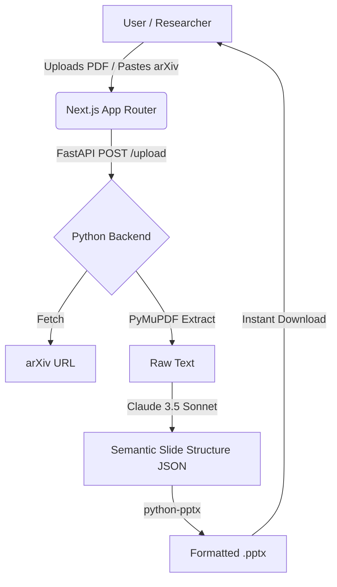

# Paper2Slides (Acquisition Asset)

> **Turn arXiv papers into seminar-ready presentations instantly.**

Paper2Slides is an ultra-lean, highly optimized microSaaS designed to solve a specific, painful problem for researchers and PhD students: formatting complex academic papers into concise, visually clean presentations.

## 📈 Investment Thesis

The academic software market is filled with clunky, slow, legacy tools. Paper2Slides offers a modern, incredibly fast AI solution for a recurring pain point: presenting research. 

This asset is built specifically to be **acquired and flipped**. It has zero technical debt, zero complex infrastructure, and a massive Total Addressable Market (TAM) of graduate students, professors, and industry researchers.

### Why Acquire This Asset?
- **Zero AI Bloat:** No vector databases, no slow OCR, no complex autonomous agents. It uses fast raw-text extraction and strict prompt engineering via Claude 3.5 Sonnet to guarantee an 8-slide structure in <20 seconds.
- **Immediate ROI for Users:** Users don't have to learn a new slide editor. They input an arXiv URL, and the product returns a standard `.pptx` file.
- **Traction-Ready Marketing:** The product includes an integrated Next.js SEO engine with 8 high-quality programmatic pages, Plausible analytics tracking, and a conversion-optimized dark-mode landing page.

## 🎯 Target Market & Monetization
- **Primary Users:** PhD Candidates, Postdocs, Principal Investigators, Lab Managers.
- **Use Cases:** Journal Clubs, Thesis Defenses, Lab Meetings, Conference Seminars.
- **Suggested Monetization:** 
  - Freemium: 1 free generation.
  - Pro Tier: $9/mo for unlimited generations, batch processing, and custom corporate/university slide templates.

## 🏗️ Architecture

The stack is optimized for Lighthouse scores (SEO), fast deployments, and easy buyer handoff.



- **Frontend:** Next.js (App Router), TailwindCSS, shadcn/ui.
- **Backend:** FastAPI (Python), `httpx` (arXiv fetching), `PyMuPDF` (PDF parsing), `python-pptx` (export).
- **AI Processing:** Anthropic Claude 3.5 Sonnet.
- **Auth:** Clerk (Fast, recognizable OAuth).
- **Analytics:** Plausible (Privacy-first, no cookie banners needed).

## 🚀 Growth Opportunities
1. **University Site Licenses:** Sell bulk seats to university physics and CS departments.
2. **Corporate Templates:** Allow users to upload their own `.potx` template files so the output perfectly matches their company branding.
3. **B2B Integration:** Offer an API for academic publishers (Elsevier, IEEE) to offer a "Download as Slides" button directly on their journals.

## 💻 Quick Start (Local Deployment)

### 1. Start the API (Backend)
```bash
cd api
python -m venv .venv
source .venv/bin/activate  # Or .\venv\Scripts\activate on Windows
pip install -r requirements.txt
export ANTHROPIC_API_KEY="your-key-here"
uvicorn main:app --reload --port 8000
```

### 2. Start the Web App (Frontend)
```bash
cd web
npm install
# Ensure Clerk variables are in .env.local
npm run dev
```

## 🌐 Production Deployment (1-Click)
- **Frontend:** Import the repository into **Vercel**. Set root directory to `web`.
- **Backend:** Import the repository into **Render** as a Web Service. Render will auto-detect the `render.yaml` file and deploy the FastAPI server.

---

*Note to buyers: Check `public/screenshots/` and `public/demo/` for promotional materials to use in your launch or Product Hunt campaign.*
